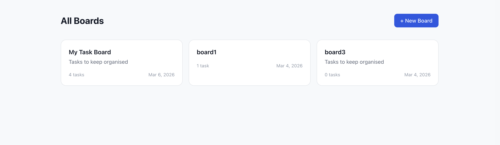
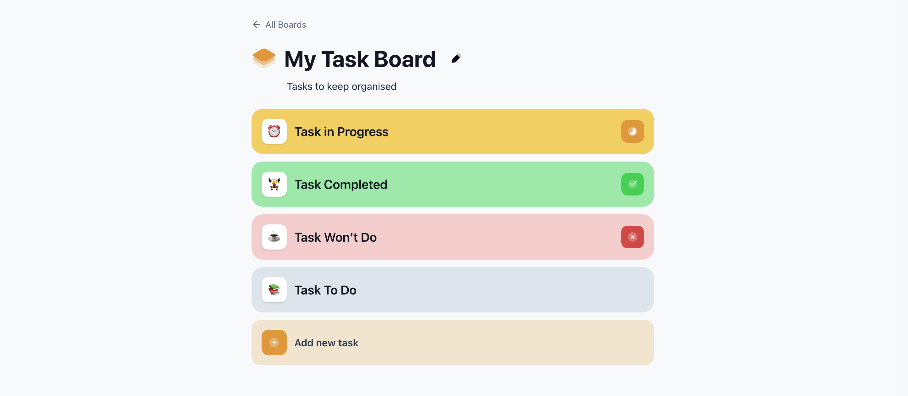
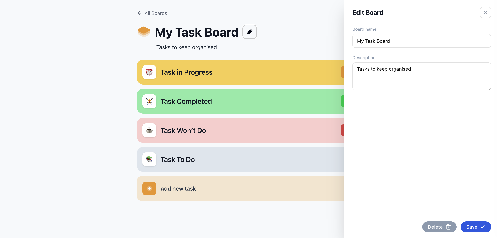
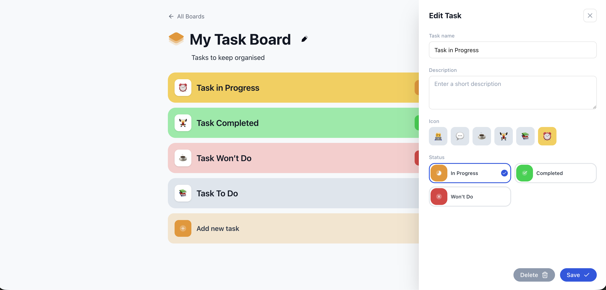

<h1 align="center">Task Board</h1>

   Solution for a challenge <a href="https://devchallenges.io/challenge/my-task-board-app" target="_blank">My Task Board
</a> from <a href="http://devchallenges.io" target="_blank">devChallenges.io</a>.

  <h3>
    <a href="https://task-board-rho-five.vercel.app/">
      Demo
    </a>
     | 
    <a href="https://devchallenges.io/challenge/my-task-board-app">
      Challenge
    </a>
  </h3>

<!-- TABLE OF CONTENTS -->

## Table of Contents

- [Overview](#overview)
- [Features](#features)
- [Built with](#built-with)

<!-- OVERVIEW -->

## Overview

This project is based on the [My Task Board](https://devchallenges.io/challenge/my-task-board-app) challenge from DevChallenges, with additional features beyond the original spec.

The original challenge focuses on a **single board** experience — users visit the app, a board is auto-created, and they can manage tasks on that board. There is no concept of managing multiple boards in the original design.

The following features were **extended beyond the challenge requirements**:

- **All Boards Page** — a home page that lists all existing boards, letting users switch between them or create new ones.
- **Edit Board** — a drawer UI to update the board's name and description, along with a delete board option. The original challenge only requires simple inline editing of the board name/description without a dedicated edit UI.

### All Boards Page (Extended)

View all boards and create a new board.

### Task Board Page

Edit the board, view tasks, and create/edit tasks.

Edit board (Extended)

Edit task

## Features

This application/site was created as a submission to a [DevChallenges](https://devchallenges.io/challenges-dashboard) challenge.

- Create, edit, and delete **Boards** to organize your work
- Add, edit, and delete **Tasks** within each board
- Assign a **status** to each task: Todo, In Progress, Completed, or Won't Do — each with a distinct color
- Choose from **6 emoji icons** per task

### Built with

- Next.js — App Router, Server Components & Server Actions
- TypeScript
- MongoDB + Mongoose — database & ODM
- Tailwind CSS
- [shadcn/ui](https://ui.shadcn.com/) — accessible UI components
